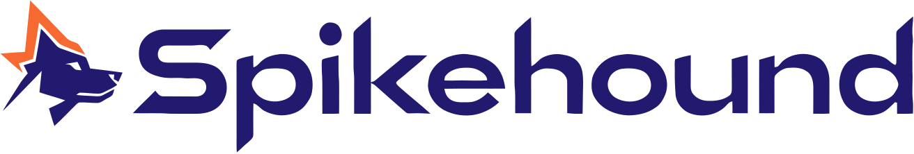

<picture>
  <source media="(prefers-color-scheme: dark)" srcset="docs/brand/logo-horizontal-dark.svg">
  
</picture>

# Spikehound

[](LICENSE)
[](https://github.com/Microck/spikehound/actions/workflows/ci-cd.yml)

**When Azure costs spike, 5 specialized agents investigate in parallel, diagnose the root cause, and propose a fix — all before a human needs to look at a dashboard.**

Spikehound is a multi-agent incident workflow for Azure cost anomalies. It ingests an Azure Monitor alert, fans out to parallel investigator agents (Cost, Resource, History), synthesizes a diagnosis via Azure AI Foundry, proposes a remediation plan, and routes it through a Slack or Discord human-approval gate. Built on .NET 8 Azure Functions with optional Durable Functions orchestration.

---

## How It Works

```
Azure Monitor Alert
        │
        ▼
POST /api/webhooks/alert
        │
        ├──── Cost Analyst Agent    ──── Cost Management API
        ├──── Resource Agent        ──── Resource Graph + Activity Logs
        └──── History Agent         ──── Azure AI Search + Cosmos DB
                        │
                        ▼
               Unified Findings
                        │
                        ▼
               Diagnosis Agent      ──── Azure AI Foundry (GPT-4o)
                        │
                        ▼
              Remediation Planner
                        │
                        ▼
          Slack / Discord notification
          [Approve] [Reject] [Investigate]
                        │
                        ▼ (on Approve)
          Remediation Engine  ──── Azure Compute (stop_vm)
                        │
                        ▼
             Follow-up notification
```

**Key properties:**
- **Parallel investigation** — Cost, Resource, and History agents run concurrently via `Task.WhenAll`
- **Two execution modes** — inline (synchronous, `200` response) or Durable Functions (async, `202` + `instanceId`)
- **Human-in-the-loop** — remediation never executes without an explicit Approve decision
- **Safe by default** — `SPIKEHOUND_ENABLE_REMEDIATION_EXECUTION=false` (the default) records decisions but skips execution
- **Idempotent** — duplicate Approve decisions for the same investigation do not trigger a second execution

---

## Quickstart (local)

**Prerequisites:**

| Tool | Version |
|------|---------|
| .NET SDK | 8 |
| Azure Functions Core Tools | v4 (`func`) |
| Azurite | any recent (`azurite`) |

**1. Clone and configure:**

```bash
git clone https://github.com/Microck/spikehound.git
cd spikehound
cp .env.example .env
# Edit .env — at minimum, review the two safety toggles (see Configuration)
set -a; source .env; set +a
```

**2. Start the storage emulator (Terminal 1):**

```bash
mkdir -p /tmp/azurite
azurite --silent --location /tmp/azurite --debug /tmp/azurite/debug.log
```

**3. Start the Functions host (Terminal 2):**

```bash
cd dotnet/src/Spikehound.Functions
func start
```

**4. Verify it's running:**

```bash
curl -sS http://localhost:7071/api/health
# → {"ok":true}
```

**5. Trigger a demo investigation:**

```bash
curl -sS -X POST http://localhost:7071/api/webhooks/alert \
  -H 'Content-Type: application/json' \
  -d '{
    "schemaId": "azureMonitorCommonAlertSchema",
    "data": {
      "essentials": {
        "alertId": "/subscriptions/00000000-0000-0000-0000-000000000000/providers/Microsoft.AlertsManagement/alerts/demo-gpu-spike-001",
        "alertRule": "GPU VM Cost Spike",
        "severity": "Sev1",
        "signalType": "Metric",
        "monitorCondition": "Fired",
        "monitoringService": "Cost Management",
        "alertTargetIDs": [
          "/subscriptions/00000000-0000-0000-0000-000000000000/resourceGroups/spikehound-demo-rg/providers/Microsoft.Compute/virtualMachines/spikehound-gpu-vm"
        ],
        "firedDateTime": "2026-02-11T10:00:00Z",
        "description": "Unexpected GPU VM running for 72 hours with $450 daily spend"
      },
      "alertContext": {
        "ResourceId": "/subscriptions/00000000-0000-0000-0000-000000000000/resourceGroups/spikehound-demo-rg/providers/Microsoft.Compute/virtualMachines/spikehound-gpu-vm",
        "costAnomaly": {
          "expectedDailyCost": 12.50,
          "actualDailyCost": 450.00,
          "anomalyFactor": 36.0
        }
      }
    }
  }'
```

Without cloud credentials configured, Spikehound runs in **fallback mode**: deterministic agents produce a complete investigation report without hitting Azure APIs. Swap in real credentials to enable live Cost Management, Resource Graph, and Foundry calls.

---

## Repository Layout

```
spikehound/
├── dotnet/
│   ├── Spikehound.sln
│   ├── src/
│   │   ├── Spikehound.Core/          # Agent interfaces, models, orchestration pipeline
│   │   └── Spikehound.Functions/     # Azure Functions host (HTTP triggers, Durable)
│   └── tests/
│       └── Spikehound.Core.Tests/    # xUnit unit tests
├── demo/
│   ├── scenario.md                   # Staged GPU-VM cost anomaly walkthrough
│   ├── stage_anomaly.sh              # Bootstrap demo infra
│   └── cleanup_demo.sh               # Tear down demo infra
├── docs/
│   ├── architecture.mmd              # Mermaid source
│   ├── architecture-light.svg        # Rendered diagram (light mode)
│   ├── architecture-dark.svg         # Rendered diagram (dark mode)
│   └── render_architecture.sh        # Diagram render script
├── infra/
│   └── foundry_config.yaml           # Azure AI Foundry project config
├── scripts/
│   ├── dev.sh                        # Local dev helper
│   ├── cost_management_smoke.py      # Cost Management API smoke test
│   └── foundry_smoke.py              # Foundry connectivity smoke test
├── .env.example                      # Environment variable template
└── .github/workflows/ci-cd.yml       # GitHub Actions CI/CD
```

---

## Configuration

Copy `.env.example` to `.env` and fill in values for the modes you want to use:

```bash
cp .env.example .env
set -a; source .env; set +a
```

### Safety toggles

| Variable | Default | Description |
|----------|---------|-------------|
| `SPIKEHOUND_USE_DURABLE` | `false` | `false` = inline pipeline (sync `200`); `true` = Durable orchestration (async `202`) |
| `SPIKEHOUND_ENABLE_REMEDIATION_EXECUTION` | `false` | `false` = record decisions, skip execution; `true` = execute approved actions against Azure |

**Recommendation:** keep both at their defaults until you have a safe demo VM to target.

### Azure credentials (optional — enables live agent calls)

| Variable | Purpose |
|----------|---------|
| `AZURE_TENANT_ID` | Service principal tenant |
| `AZURE_CLIENT_ID` | Service principal client ID |
| `AZURE_CLIENT_SECRET` | Service principal secret |
| `AZURE_SUBSCRIPTION_ID` | Target subscription for Cost Management / Resource Graph |

### Azure AI Foundry (optional — enables LLM diagnosis)

| Variable | Purpose |
|----------|---------|
| `FOUNDRY_ENDPOINT` | Azure OpenAI / Foundry endpoint URL |
| `FOUNDRY_MODEL` | Deployment name (e.g. `spikehound-gpt4o`); comma-separated list for fallback |
| `FOUNDRY_API_KEY` | API key |
| `FOUNDRY_API_VERSION` | API version (`2024-08-01-preview` for Structured Outputs) |
| `AZURE_AI_PROJECT_ENDPOINT` | Azure AI Project endpoint (for `Azure.AI.Projects`) |

### Slack integration (optional)

| Variable | Purpose |
|----------|---------|
| `SLACK_WEBHOOK_URL` | Incoming Webhook URL for notifications |
| `SLACK_SIGNING_SECRET` | Used to verify `X-Slack-Signature` on interaction callbacks |

Configure Slack Interactivity Request URL to: `https://<your-host>/api/webhooks/slack/actions`

### Discord integration (optional)

| Variable | Purpose |
|----------|---------|
| `DISCORD_WEBHOOK_URL` | Webhook URL for notification-only delivery |
| `DISCORD_BOT_TOKEN` | Bot token — enables interactive buttons (recommended) |
| `DISCORD_CHANNEL_ID` | Target channel for bot messages |
| `DISCORD_INTERACTIONS_PUBLIC_KEY` | Required to verify signed interaction callbacks |

Configure Discord Interactions Endpoint URL to: `https://<your-host>/api/webhooks/discord/interactions`

> **Bot mode vs webhook mode:** Webhook-only Discord delivery sends plain notifications. To get interactive Approve/Reject/Investigate buttons, configure `DISCORD_BOT_TOKEN` + `DISCORD_CHANNEL_ID`.

For local callback testing with Slack or Discord, use a tunnel such as [ngrok](https://ngrok.com):

```bash
ngrok http 7071
# → set the HTTPS forwarding URL as your Slack/Discord callback endpoint
```

---

## API Reference

Local base URL: `http://localhost:7071`

### `POST /api/webhooks/alert`

Ingests an Azure Monitor Common Alert Schema payload and triggers the investigation pipeline.

**Inline mode** (`SPIKEHOUND_USE_DURABLE=false`):
- Returns `200` with a full investigation report (`UnifiedFindings`, `DiagnosisResult`, `RemediationResult`)
- Duplicate submissions for the same `alertId` return the cached report

**Durable mode** (`SPIKEHOUND_USE_DURABLE=true`):
- Returns `202` with `{ "mode": "durable", "accepted": true, "instanceId": "..." }`

### `GET /api/health`

Returns `{"ok":true}`. Use for readiness checks.

### `POST /api/webhooks/slack/actions`

Receives Slack interactivity callbacks (button clicks). Verifies `X-Slack-Signature` using `SLACK_SIGNING_SECRET`. Returns `401` for unsigned or tampered requests.

Supported `action_id` values: `approve_remediation`, `reject_remediation`, `investigate_more`

### `POST /api/webhooks/discord/interactions`

Receives Discord interaction callbacks. Verifies Ed25519 signature using `DISCORD_INTERACTIONS_PUBLIC_KEY`. Responds to `type=1` pings. Returns `401` for invalid signatures.

Supported interaction types: `approve_remediation`, `reject_remediation`, `investigate_more`

---

## Architecture

<picture>
  <source media="(prefers-color-scheme: dark)" srcset="docs/architecture-dark.svg">
  
</picture>

**Agents and their roles:**

| Agent | Data Source | Output |
|-------|-------------|--------|
| **Cost Analyst** | Azure Cost Management API | Top cost drivers, anomaly factor, daily spend |
| **Resource Agent** | Azure Resource Graph + Activity Logs | VM configuration, recent changes, who touched what |
| **History Agent** | Azure AI Search + Cosmos DB | Similar past incidents (RAG) |
| **Diagnosis Agent** | Azure AI Foundry (GPT-4o) | Root cause hypothesis + confidence score |
| **Remediation Agent** | Diagnosis output | Ranked action list (`stop_vm`, `notify_owner`, …) |
| **Coordinator** | All agents | Fan-out orchestration, unified findings aggregation |

All three investigator agents run in parallel. The coordinator waits for all three before passing unified findings to the Diagnosis Agent.

Diagram source: [`docs/architecture.mmd`](docs/architecture.mmd) — re-render with `bash docs/render_architecture.sh`.

---

## Development

```bash
cd dotnet
dotnet build Spikehound.sln
dotnet test Spikehound.sln
```

**Running a specific test project:**

```bash
dotnet test dotnet/tests/Spikehound.Core.Tests
```

**Starting the Functions host with a specific mode:**

```bash
# Inline mode (default)
cd dotnet/src/Spikehound.Functions
func start

# Durable mode
SPIKEHOUND_USE_DURABLE=true func start
```

**Enabling cloud calls locally:**

Set `SPIKEHOUND_CLOUD_ENABLED=true` in `.env` along with the Azure credential variables. All agents check this gate before making Azure API calls; with it off they return deterministic fallback results.

**Optional smoke tests** (require Azure credentials):

```bash
python3 scripts/cost_management_smoke.py
python3 scripts/foundry_smoke.py
```

---

## Testing

```bash
cd dotnet
dotnet test Spikehound.sln
```

The test suite covers:

- **Unit tests** — agent logic, alert normalization, approval deduplication
- **E2E smoke** — inline mode success path, idempotent duplicate path
- **Edge cases** — invalid JSON → `400`, unsigned Slack/Discord callbacks → `401`
- **Durable mode** — scheduling response `202` with `instanceId`

For a full interactive validation walkthrough (including Slack and Discord callback testing), see [`demo/scenario.md`](demo/scenario.md).

---

## CI/CD

GitHub Actions workflow: [`.github/workflows/ci-cd.yml`](.github/workflows/ci-cd.yml)

| Job | Trigger | What it does |
|-----|---------|-------------|
| `Build And Unit Tests` | every push/PR | Builds `dotnet/Spikehound.sln`, runs xUnit tests |
| `Local E2E And Edge Cases` | every push/PR | Boots Azurite + Functions host, runs curl-based E2E assertions |
| `Deploy Azure Function App` | push to `main` only | Deploys to Azure (requires repo secrets) |

**To enable Azure deployment**, add to your repository:
- Repository variable: `SPIKEHOUND_FUNCTIONAPP_NAME`
- Repository secret: `SPIKEHOUND_FUNCTIONAPP_PUBLISH_PROFILE`

---

## Demo Scenario

The reference scenario simulates a GPU VM left running for 72 hours after a training job completed, causing cost to spike from $12.50/day to $450/day (36× anomaly factor).

See [`demo/scenario.md`](demo/scenario.md) for the complete walkthrough, including:
- How to trigger the investigation with a `curl` command
- Expected per-agent outputs
- The Slack/Discord approval flow
- How to stage and clean up real Azure demo infrastructure

---

## Security

- **Remediation is gated.** `SPIKEHOUND_ENABLE_REMEDIATION_EXECUTION` defaults to `false`. No Azure resource actions execute without both an explicit Approve decision and this flag set to `true`.
- **Callback signatures are verified.** Slack callbacks require a valid `X-Slack-Signature`; Discord callbacks require a valid Ed25519 signature. Unsigned requests return `401`.
- **Credentials stay out of source.** `.env` is gitignored. Only `.env.example` (no secrets) is committed.
- **Service principal recommended.** For automation, use a service principal scoped to the minimum required permissions rather than user credentials.

---

## Contributing

Issues and pull requests are welcome.

1. Fork the repository and create a feature branch
2. Run `dotnet test` — all tests must pass
3. Open a pull request with a clear description of what changed and why

For substantial changes, open an issue first to discuss the approach.

---

## License

Apache-2.0 — see [`LICENSE`](LICENSE).

---

## Origin

Spikehound was built during the Microsoft AI Dev Days Hackathon 2026 (Feb–Mar 2026), targeting the Agentic DevOps, Multi-Agent, and Azure Integration prize tracks. The repository is structured as a normal OSS project and is intended to be runnable outside of the hackathon context.
