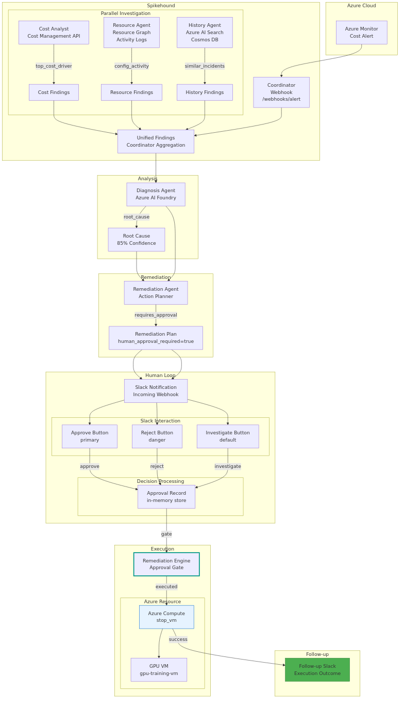

# README Outline (Top-Repo Pattern)

Generated from `projects/spikehound` with apply mode ON (README.md modified via a single marker block).

## Project signals (detected)

- README: `README.md`
- License: `LICENSE` (Apache-2.0)
- Primary runtime: .NET 8 Azure Functions (isolated worker)
  - Solution: `dotnet/Spikehound.sln`
  - Function app: `dotnet/src/Spikehound.Functions/Spikehound.Functions.csproj`
- API style: HTTP-triggered Functions (webhooks + health)
- Docs/diagrams: `docs/architecture.mmd`, `docs/architecture.png`
- Demo assets: `demo/scenario.md`, `demo/*.sh`
- Foundry/Azure integrations hinted via env vars: `.env.example`, `infra/foundry_config.yaml`
- Roadmap/planning: `.planning/ROADMAP.md`
- Note: `scripts/dev.sh` references `requirements.txt` / `requirements-dev.txt`, but no requirements files were found under this directory.

## 1) Current README headings (verbatim)

1. Spikehound
2. Installation
3. Testing
4. Support / Community
5. Changelog / Releases
6. Roadmap
7. Features
8. Quickstart (local)
9. Usage
10. API
11. Configuration
12. Architecture
13. Development
14. Security
15. Contributing
16. License
17. Origin

## 2) Recommended outline (canonical headings)

1. Spikehound (title) + one-line value prop + license badge
2. Quickstart (local)
3. Installation
4. Usage
5. Configuration
6. API Reference
7. Architecture
8. Development
9. Testing
10. Contributing
11. Support / Community
12. Security
13. License
14. Changelog / Releases
15. Roadmap
16. Origin / Background (optional)

Optional inserts (only if useful):

- Features (can remain near the top, but avoid repeating Quickstart)
- Demo walkthrough (link to `demo/scenario.md`)
- Deployment (Azure Functions)

## 3) Mapping: current -> recommended

| Current heading | Recommended section |
| --- | --- |
| Spikehound | Spikehound (title + intro) |
| Installation | Installation |
| Testing | Testing |
| Support / Community | Support / Community |
| Changelog / Releases | Changelog / Releases |
| Roadmap | Roadmap |
| Features | (Optional) Features |
| Quickstart (local) | Quickstart (local) |
| Usage | Usage |
| API | API Reference |
| Configuration | Configuration |
| Architecture | Architecture |
| Development | Development |
| Security | Security |
| Contributing | Contributing |
| License | License |
| Origin | Origin / Background |

## 4) Missing sections checklist

None (skeleton sections for Installation/Testing/Support/Community/Changelog/Releases/Roadmap were added under the `top-readme` marker block).

Still optional to add (not inserted):

- Deployment (Azure Functions)

## 5) Ready-to-copy README skeleton (tailored)

```md
# Spikehound

[](LICENSE)

Spikehound is a multi-agent incident workflow for Azure cost anomalies.

## Quickstart (local)

Prereqs:
- .NET 8 SDK
- Azure Functions Core Tools v4 (`func`)

```bash
cp .env.example .env
set -a; source .env; set +a

cd dotnet
dotnet test
cd src/Spikehound.Functions
func start
```

```bash
curl -sS http://localhost:7071/api/health
```

## Installation

TODO: Add repository layout + what you need to install for:
- running the Functions app locally
- running optional integrations (Slack/Discord)

## Usage

- Trigger an investigation via the demo: `demo/scenario.md`
- High-level flow:

```text
alert -> /api/webhooks/alert -> parallel agents -> diagnosis -> remediation plan
```

TODO: Add one end-to-end example request/response (redact secrets).

## Configuration

Copy `.env.example` to `.env` and set what you need.

Key toggles:
- `SPIKEHOUND_USE_DURABLE=false` (inline) / `true` (durable scheduling)

Integrations (optional):
- Azure credentials (`AZURE_*`)
- Azure AI Foundry / OpenAI deployment (`FOUNDRY_*`)
- Slack (`SLACK_*`)
- Discord (`DISCORD_*`)

TODO: Document which env vars are required for each mode.

## API Reference

Base URL (local): `http://localhost:7071`

- `POST /api/webhooks/alert` (alert ingestion)
- `GET /api/health`
- `POST /api/webhooks/slack/actions`
- `POST /api/webhooks/discord/interactions`

Behavior notes:
- Inline mode: returns `200` with investigation report payload
- Durable mode (`SPIKEHOUND_USE_DURABLE=true`): returns `202` after scheduling orchestration

TODO: Add example payloads + response schema (or link to a spec file).

## Architecture



Sources:
- Mermaid: `docs/architecture.mmd`

TODO: Add 5-10 bullets describing components/agents and data flow.

## Development

```bash
cd dotnet
dotnet test
```

TODO: Add formatting/linting, how to run Functions app in debug.

## Testing

```bash
cd dotnet
dotnet test
```

TODO: Add any integration smoke tests and required env vars.

## Deployment (optional)

TODO: Document how to deploy to Azure Functions (infra, settings, secrets handling).

## Support / Community

TODO: Where to ask questions / file issues.

## Security

This project may execute remediation actions when enabled. Treat credentials and webhooks as sensitive.

TODO: Document the recommended demo-safe posture and how to disable remediation.

## Contributing

Issues and pull requests are welcome.

TODO: Add development workflow, PR guidelines, and code of conduct link (if applicable).

## License

Apache-2.0 (see `LICENSE`).

## Changelog / Releases

TODO: Add `CHANGELOG.md` or link to GitHub Releases.

## Roadmap

TODO: List 3-6 near-term improvements.

## Origin

Spikehound was built during a hackathon and optimized for a reproducible demo, but the repository is structured as a normal OSS project.
```
